# Imstructions for setting up the chain

CD into your blockchain_rules folder

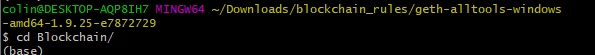

## Create accounts for two nodes for the network with a separate datadir for each using geth. 

`./geth --datadir node1 account new`

`./geth --datadir node2 account new`

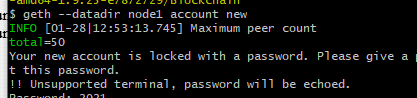

create password

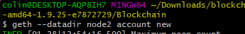

open VS Code

`code .`

run puppeth

`./puppeth`

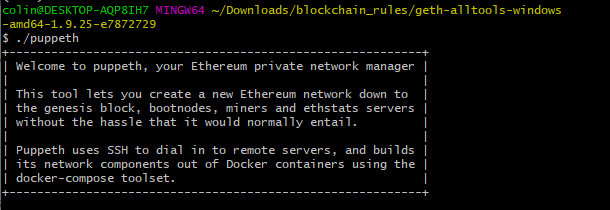

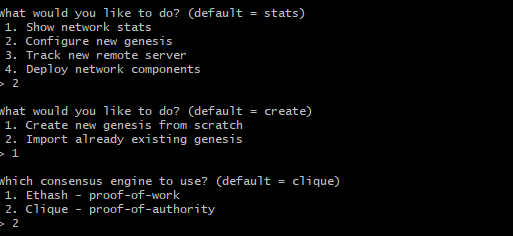

Paste accounts into the seal

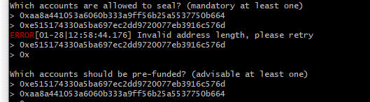

`’Manage existing genesis’`

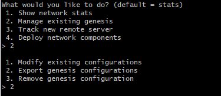

## Initialize the nodes with the genesis' json file

Initialize each node

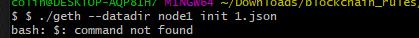

## Use nodes to mine blocks

#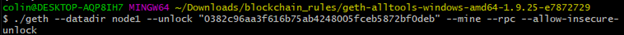

Type password

## Open MyCrypto

Select Change network

Setup custom node

#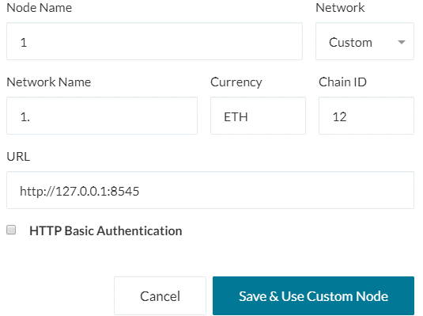

## Test the transaction

#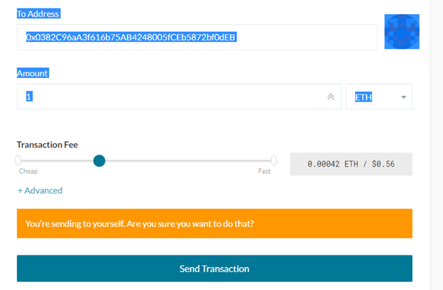

## Check status

#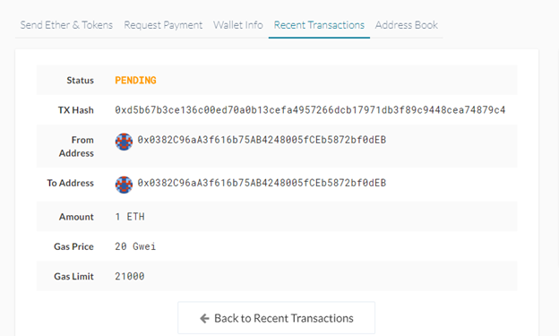

When completed the Status will change from "PENDING" to "SUCCESSFUL"